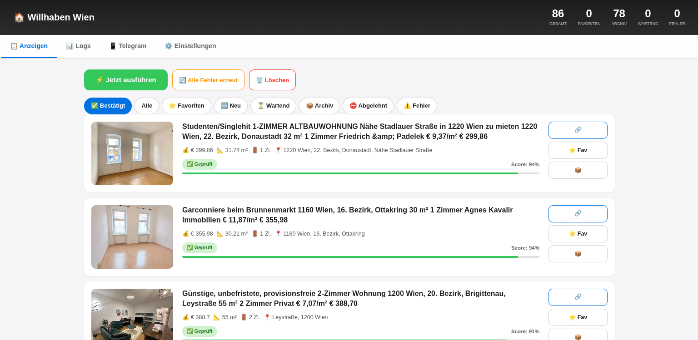

# 🏠 Vienna Housing Finder

> An automated real-time housing scraper, AI-powered evaluator, and Telegram notifier for Vienna apartment listings on [Willhaben.at](https://www.willhaben.at/), built entirely on the **Cloudflare Workers** ecosystem.

[](https://workers.cloudflare.com/)
[](https://developers.cloudflare.com/d1/)
[](https://developers.cloudflare.com/workers-ai/)

---

## 📖 Table of Contents

- [Overview](#-overview)
- [Key Features](#-key-features)
- [Architecture](#-architecture)
- [Data Flow](#-data-flow)
- [Tech Stack](#-tech-stack)
- [Database Schema](#-database-schema)
- [Installation & Deployment](#-installation--deployment)
  - [Prerequisites](#1-prerequisites)
  - [Clone the Repository](#2-clone-the-repository)
  - [Create the D1 Database](#3-create-the-d1-database)
  - [Configure wrangler.toml](#4-configure-wranglertoml)
  - [Apply the Database Schema](#5-apply-the-database-schema)
  - [Set Environment Secrets](#6-set-environment-secrets)
  - [Deploy the Worker](#7-deploy-the-worker)
  - [Register the Telegram Webhook](#8-register-the-telegram-webhook)
  - [Set Up the Cron Trigger](#9-set-up-the-cron-trigger)
- [Configuration Reference](#-configuration-reference)
- [API Reference](#-api-reference)
- [Telegram Bot Commands](#-telegram-bot-commands)
- [AI Quota Management](#-ai-quota-management)
- [Web Dashboard](#-web-dashboard)
- [Project Structure](#-project-structure)
- [Troubleshooting](#-troubleshooting)
- [Limitations](#-limitations)
- [License](#-license)

---

## 🎯 Overview

**Vienna Housing Finder** is a fully serverless application that:

1. **Scrapes** rental listings from Willhaben.at (Vienna area, under a configurable price cap) on a fixed schedule.
2. **Extracts** structured data from each listing page using **Cloudflare Workers AI** (`@cf/qwen/qwen3.8-27b`).
3. **Evaluates** each listing against a set of business rules using the **TypeSafe Jev Engine** (`jev-1.13.0`), producing a confidence score.
4. **Notifies** subscribed Telegram users instantly when a high-scoring listing is found.
5. **Displays** everything through a mobile-friendly web dashboard with filtering, favorites, archive, and full error logs.

The entire application runs on Cloudflare's free tier (with quota limitations explained in [AI Quota Management](#-ai-quota-management)).

---

## 📸 Screenshots



---

## ✨ Key Features

| Feature | Description |
| :--- | :--- |
| 🤖 **AI Data Extraction** | Uses Workers AI (Qwen 3.8 27B) to convert raw HTML into structured JSON (rent, size, address, rooms, property type, Gemeindewohnung/Genossenschaft detection). |
| ⚖️ **Jev-Based Evaluation** | TypeSafe Jev Engine (`jev-1.13.0`) answers a fixed set of questions per listing and computes a score between 0 and 1. |
| 📱 **Telegram Notifications** | Sends rich alerts to all active subscribers with property details and a direct link. |
| 🔁 **Duplicate Detection** | Uses Willhaben's listing code as a unique key (`INSERT OR IGNORE`). |
| ✏️ **Edit Detection** | If a listing's address + size matches an existing entry, it is treated as an edit and the existing record is updated. |
| 🚫 **Smart Filtering** | Rejects WG-Zimmer, Gemeindewohnung, Genossenschaftswohnung, "Nicht für Wohnzwecke", "Reserviert", etc. |
| 🎯 **Mutex Lock** | Prevents overlapping cron runs that could lock the D1 database. |
| 💾 **D1 Persistence** | All listings, logs, settings, and Telegram users are stored in Cloudflare D1 (SQLite). |
| 🌐 **Server-Rendered UI** | Responsive dashboard rendered directly from the Worker with tabs for Listings, Logs, Telegram, and Settings. |
| ⚙️ **Runtime Settings** | Price cap, allowed property types, target city, and exclusions are editable without redeploying. |
| 🔄 **Manual Triggers** | UI buttons to force a run, retry all failed listings, or reset the database. |

---

## 🏗️ Architecture

```
┌─────────────────────────────────────────────────────────────────────┐
│                        Cloudflare Edge                              │
│                                                                     │
│  ┌─────────────────┐          ┌─────────────────────────────────┐   │
│  │  Cron Trigger   │─────────▶│   Cloudflare Worker             │   │
│  │  (external or   │          │   (src/index.js)                │   │
│  │   native */5)   │          │                                 │   │
│  └─────────────────┘          │   ┌─────────────────────────┐   │   │
│                               │   │  handleCron()           │   │   │
│  ┌─────────────────┐          │   │  1. Scraping            │   │   │
│  │  Telegram Bot   │          │   │  2. Extraction (AI)     │   │   │
│  │  Webhook        │◀────────▶│   │  3. Jev Evaluation      │   │   │
│  └─────────────────┘          │   │  4. Telegram Notify     │   │   │
│                               │   │  5. Cleanup + Log       │   │   │
│  ┌─────────────────┐          │   └─────────────────────────┘   │   │
│  │  Browser UI     │◀────────▶│                                 │   │
│  │  (Server-Side   │          │   ┌─────────────────────────┐   │   │
│  │   Rendered)     │          │   │  External Services:     │   │   │
│  └─────────────────┘          │   │  • Willhaben.at         │   │   │
│                               │   │  • Workers AI (Qwen)    │   │   │
│                               │   │  • TypeSafe AI (Jev)    │   │   │
│                               │   │  • Telegram Bot API     │   │   │
│                               │   └─────────────────────────┘   │   │
│                               │                                 │   │
│                               │   ┌─────────────────────────┐   │   │
│                               │   │  Cloudflare D1 (SQLite) │   │   │
│                               │   │  • listings             │   │   │
│                               │   │  • notified_listings    │   │   │
│                               │   │  • request_logs         │   │   │
│                               │   │  • settings             │   │   │
│                               │   │  • system_state         │   │   │
│                               │   │  • telegram_users       │   │   │
│                               │   └─────────────────────────┘   │   │
│                               └─────────────────────────────────┘   │
└─────────────────────────────────────────────────────────────────────┘
```

---

## 🔄 Data Flow

### Cron Execution Flow (every 5 minutes)

```
1. acquireCronLock()
   ├─ If another cron is running (< 5 min) → skip
   └─ Otherwise → write lock flag to system_state

2. scrapeWillhabenPages()
   ├─ Fetch pages 1..5 of Willhaben search results
   ├─ Extract listing links (regex)
   ├─ Filter out listings whose willhaben_code already exists
   └─ INSERT new listings with extraction_done = 0

3. runExtractionStage(limit=3)   [only if AI quota available]
   ├─ For each listing with extraction_done = 0:
   │   ├─ Fetch listing detail page
   │   ├─ Clean HTML (strip <style>, <script>, comments)
   │   ├─ Send to Workers AI (Qwen) → get JSON
   │   ├─ Edit-detection: if address+size matches existing → UPDATE
   │   └─ Otherwise → UPDATE with extracted_data, extraction_done = 1
   └─ On AI error → set extraction_done = -1 (marks as failed)

4. runJevStage(limit=10)
   ├─ For each listing with extraction_done = 1 AND jev_done = 0:
   │   ├─ Local keyword filter (WG, Gemeindewohnung, etc.)
   │   ├─ If rejected → mark jev_done = 1, status = archived
   │   └─ Otherwise → call Jev API → store jev_result + jev_score
   │       └─ If score >= 0.7 → notifyTelegram()

5. Cleanup (every 10 minutes)
   └─ DELETE FROM request_logs WHERE created_at < now - 48h

6. Batch-insert success logs

7. releaseCronLock()
```

### Request Flow (Web UI)

```
Browser → GET /  → serveUI()
                    ├─ Promise.all([
                    │   SELECT stats FROM listings,
                    │   SELECT settings,
                    │   SELECT COUNT telegram_users,
                    │   isAiQuotaExhausted()
                    │  ])
                    ├─ Render tab (listings / logs / telegram / settings)
                    └─ Return HTML (server-rendered, no cache)

Browser → GET /api/listings?filter=X&page=N
         → returns JSON (used by the UI for pagination)
```

---

## 🛠️ Tech Stack

| Layer | Technology |
| :--- | :--- |
| **Runtime** | Cloudflare Workers (V8 isolates) |
| **Database** | Cloudflare D1 (SQLite-based, serverless) |
| **AI (Extraction)** | Cloudflare Workers AI — `@cf/qwen/qwen3.8-27b` |
| **AI (Decision)** | TypeSafe AI — `jev-1.13.0` |
| **Notifications** | Telegram Bot API |
| **Frontend** | Server-Rendered HTML + Vanilla JS |
| **Scheduling** | External cron (cron-job.org) or Cloudflare native cron |

---

## 🗄️ Database Schema

### `listings` — Main table

| Column | Type | Description |
| :--- | :--- | :--- |
| `id` | INTEGER PK | Auto-increment ID |
| `willhaben_code` | TEXT UNIQUE | Willhaben listing ID |
| `url` | TEXT | Full listing URL |
| `title` | TEXT | Listing title |
| `scraped_at` | TEXT | When the listing was first scraped |
| `extracted_data` | TEXT (JSON) | Structured data from Workers AI |
| `extraction_done` | INTEGER | `0` = pending, `1` = done, `-1` = failed |
| `jev_result` | TEXT (JSON) | Full Jev response |
| `jev_score` | REAL | Score from Jev (0.0 – 1.0) |
| `jev_done` | INTEGER | `0` = pending, `1` = done, `-1` = failed |
| `status` | TEXT | `new`, `favorite`, `archived` |
| `image_url` | TEXT | Preview image |
| `address` | TEXT | Extracted address |
| `size_m2` | REAL | Size in m² |
| `total_cost_eur` | REAL | Total monthly cost in EUR |
| `raw_text` | TEXT | Full cleaned text (for keyword filtering) |
| `created_at`, `updated_at` | TEXT | Timestamps |

### Other tables

| Table | Purpose |
| :--- | :--- |
| `notified_listings` | Prevents sending duplicate alerts (`listing_id` + `chat_id`) |
| `request_logs` | Logs errors and success messages (retention: 48h) |
| `settings` | Key-value store for runtime config |
| `system_state` | Mutex lock and AI quota state |
| `telegram_users` | Subscribed Telegram users with block status |

---

## 🚀 Installation & Deployment

### 1. Prerequisites

- **Node.js** v18+ ([download](https://nodejs.org/))
- **npm** (comes with Node)
- A **Cloudflare account** (free tier works) — [sign up](https://dash.cloudflare.com/sign-up)
- A **Telegram bot token** — get one from [@BotFather](https://t.me/BotFather)
- A **TypeSafe AI API key** — from [typesafe.ai](https://typesafe.ai/)

Install Wrangler CLI globally:

```bash
npm install -g wrangler
wrangler login
```

---

### 2. Clone the Repository

```bash
git clone https://github.com/YOUR_USERNAME/vienna-housing.git
cd vienna-housing
```

---

### 3. Create the D1 Database

```bash
npx wrangler d1 create vienna-housing-db
```

The output will include a `database_id`. Copy it — you'll need it in the next step.

---

### 4. Configure `wrangler.toml`

Create a `wrangler.toml` file at the project root:

```toml
name = "vienna-housing"
main = "src/index.js"
compatibility_date = "2024-02-08"

# ─── D1 Database Binding ─────────────────────────────────────────────
[[d1_databases]]
binding = "DB"
database_name = "vienna-housing-db"
database_id = "PASTE_YOUR_DATABASE_ID_HERE"

# ─── Workers AI Binding ──────────────────────────────────────────────
[ai]
binding = "AI"

# ─── Non-secret Environment Variables ────────────────────────────────
[vars]
WILLHABEN_URL = "https://www.willhaben.at/iad/immobilien/mietwohnungen/mietwohnung-angebote?sfId=f224226b-34c5-44e5-a64c-a2da4261f249&isNavigation=true&areaId=900&rows=90&PRICE_TO=550"
WORKER_URL    = "https://YOUR-SUBDOMAIN.workers.dev"

# ─── Cron Trigger (optional — see step 9) ────────────────────────────
# [triggers]
# crons = ["*/5 * * * *"]
```

> **Note on `WORKER_URL`:** This value is used inside the Telegram bot's "Dashboard" button and in cron-job.org setups. Set it to the URL Cloudflare assigns after your first deploy (e.g. `https://vienna-housing.<account>.workers.dev`).

> **Note on `WILLHABEN_URL`:** This is the URL of the Willhaben search results page. You can customize the filter (price cap, area, etc.) directly in the URL.

> **Cron Trigger warning:** Only enable the native `[triggers]` block **if you are NOT using an external cron service**. Running both simultaneously will cause overlapping runs and database locks.

---

### 5. Apply the Database Schema

Create a file named `schema.sql` at the project root with the following content:

```sql
CREATE TABLE IF NOT EXISTS listings (
  id INTEGER PRIMARY KEY AUTOINCREMENT,
  willhaben_code TEXT UNIQUE NOT NULL,
  url TEXT NOT NULL,
  title TEXT,
  scraped_at TEXT DEFAULT (datetime('now')),
  extracted_data TEXT,
  extraction_done INTEGER DEFAULT 0,
  jev_result TEXT,
  jev_score REAL DEFAULT 0,
  jev_done INTEGER DEFAULT 0,
  status TEXT DEFAULT 'new',
  image_url TEXT,
  address TEXT,
  size_m2 REAL,
  total_cost_eur REAL,
  raw_text TEXT,
  created_at TEXT DEFAULT (datetime('now')),
  updated_at TEXT DEFAULT (datetime('now'))
);

CREATE INDEX IF NOT EXISTS idx_listings_extraction   ON listings(extraction_done);
CREATE INDEX IF NOT EXISTS idx_listings_jev          ON listings(jev_done);
CREATE INDEX IF NOT EXISTS idx_listings_status       ON listings(status);
CREATE INDEX IF NOT EXISTS idx_listings_score        ON listings(jev_score DESC);
CREATE INDEX IF NOT EXISTS idx_listings_scraped      ON listings(scraped_at DESC);
CREATE INDEX IF NOT EXISTS idx_listings_code         ON listings(willhaben_code);

CREATE TABLE IF NOT EXISTS notified_listings (
  listing_id INTEGER NOT NULL,
  chat_id TEXT NOT NULL,
  sent_at TEXT DEFAULT (datetime('now')),
  PRIMARY KEY (listing_id, chat_id)
);

CREATE TABLE IF NOT EXISTS request_logs (
  id INTEGER PRIMARY KEY AUTOINCREMENT,
  service TEXT NOT NULL,
  url TEXT,
  status INTEGER,
  request_snippet TEXT,
  response_snippet TEXT,
  error TEXT,
  duration_ms INTEGER,
  created_at TEXT DEFAULT (datetime('now'))
);

CREATE INDEX IF NOT EXISTS idx_logs_created ON request_logs(created_at DESC);
CREATE INDEX IF NOT EXISTS idx_logs_service ON request_logs(service);

CREATE TABLE IF NOT EXISTS settings (
  key TEXT PRIMARY KEY,
  value TEXT,
  updated_at TEXT DEFAULT (datetime('now'))
);

CREATE TABLE IF NOT EXISTS system_state (
  key TEXT PRIMARY KEY,
  value TEXT,
  updated_at TEXT DEFAULT (datetime('now'))
);

CREATE TABLE IF NOT EXISTS telegram_users (
  chat_id TEXT PRIMARY KEY,
  username TEXT,
  first_name TEXT,
  subscribed_at TEXT DEFAULT (datetime('now')),
  is_active INTEGER DEFAULT 1,
  is_blocked INTEGER DEFAULT 0,
  last_seen TEXT,
  notifications_sent INTEGER DEFAULT 0
);

-- Default settings
INSERT OR IGNORE INTO settings (key, value) VALUES
  ('max_price', '550'),
  ('allowed_property_types', 'apartment,studio'),
  ('target_city', 'Wien');

-- Initial system state
INSERT OR IGNORE INTO system_state (key, value) VALUES
  ('cron_running', '0'),
  ('ai_quota_exhausted_until', ''),
  ('last_cleanup', '0');
```

Apply it to the **remote** D1 database:

```bash
npx wrangler d1 execute vienna-housing-db --remote --file=./schema.sql
```

---

### 6. Set Environment Secrets

Secrets are stored encrypted by Cloudflare. Add them with `wrangler secret put`:

```bash
npx wrangler secret put TELEGRAM_BOT_TOKEN
# Paste your bot token from @BotFather when prompted

npx wrangler secret put TYPESAFE_API_KEY
# Paste your TypeSafe API key when prompted
```

Verify they are set:

```bash
npx wrangler secret list
```

---

### 7. Deploy the Worker

```bash
npx wrangler deploy
```

The CLI will output the URL where your worker is deployed, e.g.:

```
https://vienna-housing.<your-subdomain>.workers.dev
```

Copy this URL and update the `WORKER_URL` value in `wrangler.toml`, then redeploy:

```bash
npx wrangler deploy
```

---

### 8. Register the Telegram Webhook

For the Telegram bot to receive commands (`/start`, `/stop`, `/status`), you must tell Telegram where to send updates.

**Option A — Using the built-in endpoint** (recommended):

Simply visit the following URL in your browser (replace with your actual values):

```
https://<YOUR_WORKER_URL>/api/set-webhook?url=https://<YOUR_WORKER_URL>
```

Actually, the worker exposes:

```
GET /api/set-webhook
```

which automatically computes the correct webhook URL based on the current request. So just open:

```
https://vienna-housing.<your-subdomain>.workers.dev/api/set-webhook
```

You should receive a JSON response similar to:

```json
{
  "success": true,
  "webhook_url": "https://vienna-housing.<your-subdomain>.workers.dev/telegram/webhook",
  "telegram_response": { "ok": true, "result": true, "description": "Webhook was set" }
}
```

**Option B — Manual curl** (if the endpoint is not available):

```bash
curl -X POST "https://api.telegram.org/bot<YOUR_BOT_TOKEN>/setWebhook" \
     -H "Content-Type: application/json" \
     -d '{"url":"https://<YOUR_WORKER_URL>/telegram/webhook"}'
```

---

### 9. Set Up the Cron Trigger

You have two options — **pick one, not both**.

#### Option A — Cloudflare Native Cron (simplest)

In `wrangler.toml`, uncomment:

```toml
[triggers]
crons = ["*/5 * * * *"]
```

Then redeploy:

```bash
npx wrangler deploy
```

Cloudflare will invoke the `scheduled` handler automatically every 5 minutes.

#### Option B — External Cron (recommended for free tier)

Native Cloudflare cron triggers can be unreliable on free accounts and occasionally miss invocations. For consistent behavior, use an external cron service such as **[cron-job.org](https://cron-job.org)** (free, up to 1-minute intervals):

1. Sign up at cron-job.org.
2. Create a new job:
   - **URL:** `https://<YOUR_WORKER_URL>/api/force-run`
   - **Schedule:** Every 5 minutes
   - **Method:** GET
3. Save.

> ⚠️ **Do NOT enable both native cron and external cron** — they will overlap and cause database locks.

---

## ⚙️ Configuration Reference

### Environment Variables

| Variable | Required | Where | Description |
| :--- | :--- | :--- | :--- |
| `WILLHABEN_URL` | ✅ | `wrangler.toml [vars]` | Willhaben search results URL |
| `WORKER_URL` | ✅ | `wrangler.toml [vars]` | Your deployed worker URL |
| `TELEGRAM_BOT_TOKEN` | ✅ | `wrangler secret` | Telegram bot token |
| `TYPESAFE_API_KEY` | ✅ | `wrangler secret` | TypeSafe AI API key |

### Bindings

| Binding | Type | Purpose |
| :--- | :--- | :--- |
| `DB` | D1 Database | Persistent storage |
| `AI` | Workers AI | Qwen model for extraction |

### Editable Settings (via the Web UI)

Stored in the `settings` table and changeable from the **⚙️ Einstellungen** tab:

| Key | Default | Description |
| :--- | :--- | :--- |
| `max_price` | `550` | Maximum total monthly cost (EUR) |
| `allowed_property_types` | `apartment,studio` | Comma-separated property types |
| `target_city` | `Wien` | Target city |

---

## 🔌 API Reference

All endpoints return JSON unless otherwise noted.

| Method | Endpoint | Description |
| :--- | :--- | :--- |
| `GET` | `/` | Web dashboard (HTML) |
| `POST` | `/telegram/webhook` | Telegram webhook (internal) |
| `GET` | `/api/stats` | Aggregate statistics |
| `GET` | `/api/logs` | Request logs (`?service=`, `?status=success/error`, `?limit=`) |
| `GET` | `/api/telegram-users` | List Telegram users |
| `GET` | `/api/test-telegram` | Send a test message to all active users |
| `GET` | `/api/settings` | Read current settings |
| `POST` | `/api/settings` | Update settings |
| `GET` | `/api/force-run` | Manually trigger a cron cycle |
| `GET` | `/api/reset-all` | Delete all listings and logs |
| `POST` | `/api/retry-all-failed` | Reset all listings with `-1` flags |
| `POST` | `/api/retry/:id` | Retry a single listing |
| `POST` | `/api/favorite/:id` | Mark listing as favorite |
| `POST` | `/api/unfavorite/:id` | Remove favorite mark |
| `POST` | `/api/archive/:id` | Archive a listing |
| `POST` | `/api/unarchive/:id` | Restore from archive |
| `POST` | `/api/telegram-user/:chat_id/block` | Block a user |
| `POST` | `/api/telegram-user/:chat_id/unblock` | Unblock a user |
| `POST` | `/api/telegram-user/:chat_id/test` | Send a test message to one user |
| `GET` | `/api/set-webhook` | Register the Telegram webhook |

---

## 📱 Telegram Bot Commands

| Command | Effect |
| :--- | :--- |
| `/start` | Subscribe to notifications and show the keyboard |
| `/stop` | Unsubscribe from notifications |
| `/status` | Show the number of active subscribers |
| "⏸ Stop" button | Same as `/stop` |
| "▶️ Start" button | Same as `/start` |
| "📊 Status" button | Same as `/status` |

### Notification Format

When a listing is approved by Jev with a score ≥ `0.7`, subscribers receive a message like:

```
🏠 Neue passende Wohnung!

📍 Fasangartengasse 44, 1130 Wien
💰 € 505 · 📐 44 m² · 🚪 2 Zi.
⭐ Score: 88%

🔗 Auf Willhaben öffnen
```

---

## 🤖 AI Quota Management

### Workers AI Free Tier

Cloudflare's Workers AI provides **10,000 Neurons per day** on the free plan. Each listing extraction consumes approximately **200–300 Neurons** depending on the model.

| Usage | Approximate Listings / Day |
| :--- | :--- |
| Qwen 3.8 27B | ~30–50 listings |
| Smaller fallback models | ~100–200 listings |

### What Happens When Quota Is Exhausted?

The code handles this gracefully:

1. When Workers AI returns error `4006` (quota exceeded), the function `markAiQuotaExhausted()` writes a lock timestamp into `system_state.ai_quota_exhausted_until = now + 24h`.
2. On the next cron run, `isAiQuotaExhausted()` returns `true`, and the extraction stage is **skipped**.
3. **Scraping, Jev evaluation, and Telegram notifications continue normally** for listings that already have `extracted_data`.
4. After 24 hours, the lock expires automatically and extraction resumes.

### Jev Quota

TypeSafe Jev does **not** have a documented daily limit on typical usage, but if you hit rate limits, errors are logged and the affected listing is marked with `jev_done = -1`.

### Recovering from Errors

If listings get stuck with `extraction_done = -1` or `jev_done = -1`:

- Open the dashboard.
- Click **"🔄 Alle Fehler erneut"** — this resets the flags and clears the AI quota lock so the next cron cycle retries them.

---

## 🌐 Web Dashboard

Accessible at [https://vienna-housing.lizadferi3.workers.dev/](https://vienna-housing.lizadferi3.workers.dev/).

### Tabs

| Tab | Description |
| :--- | :--- |
| **📋 Anzeigen** | Listings with filters (Bestätigt, Alle, Favoriten, Neu, Wartend, Archiv, Abgelehnt, Fehler) and pagination |
| **📊 Logs** | Last 50 request logs with filters by service (Willhaben / Workers AI / Jev / Telegram) and status (success / error) |
| **📱 Telegram** | User list with block/unblock and test-send actions |
| **⚙️ Einstellungen** | Edit `max_price`, `allowed_property_types`, and `target_city` |

### Actions

| Button | Effect |
| :--- | :--- |
| ⚡ Jetzt ausführen | Manually triggers the cron cycle |
| 🔄 Alle Fehler erneut | Resets all `-1` flags and quota |
| 🗑️ Löschen | Deletes all listings and logs (⚠️ irreversible) |
| ⭐ Fav / ⭐ Weg | Toggle favorite status |
| 📦 / 📤 | Archive / restore |
| 🔄 Retry | Retry a single failed listing |

---

## 📁 Project Structure

```
vienna-housing/
├── src/
│   └── index.js             # Main Worker code (all logic)
├── schema.sql               # Database schema (run once)
├── wrangler.toml            # Wrangler configuration
├── .env.example             # Example environment variables
├── .gitignore               # Ignored files
├── README.md                # This file
└── LICENSE                  # (optional)
```

---

## 🐛 Troubleshooting

### The dashboard is slow on first load

- **Cause:** The D1 database may be locked by an active cron run.
- **Fix:** Ensure the mutex lock is working (`CRON_LOCK_TIMEOUT_MS` should be longer than the max cron duration). If using both native and external cron, disable one.

### The webhook is not registering

- Ensure `TELEGRAM_BOT_TOKEN` is set correctly with `wrangler secret list`.
- Visit `/api/set-webhook` in the browser and check the JSON response for `"ok": true`.
- Verify Telegram can reach your worker URL (HTTPS is required).

### AI quota is exhausted but I need data now

- Wait 24 hours — the lock clears automatically.
- Alternatively, upgrade to a paid Workers AI plan.
- Or temporarily disable extraction by setting `extraction_done = 1` on all remaining listings via D1 SQL.

### Listings stuck in "Wartend"

- This means extraction hasn't completed. Check the logs (`📊 Logs` → Workers AI filter) for errors.
- If AI is failing, `extraction_done` will be `-1` and the listing appears in the "⚠️ Fehler" filter. Click **Retry** to try again.

### Database size growing too fast

- Logs are auto-deleted after 48 hours.
- If listings are accumulating (1000+), consider archiving old ones or increasing the cleanup frequency.

---

## ⚠️ Limitations

- **Willhaben scraping:** Willhaben does not provide a public API. The scraper parses HTML, so it may break if Willhaben redesigns its site.
- **AI quota:** The free tier of Workers AI is limited to 10,000 Neurons per day, which constrains throughput.
- **Telegram rate limits:** Telegram allows ~30 messages per second, so broadcast alerts are throttled.
- **Cloudflare D1:** SQLite locks the entire database during write operations. Concurrent cron runs must be prevented via the mutex lock.
- **No authentication:** The web dashboard has no login. Anyone with the URL can access it. Consider adding Cloudflare Access if you deploy it publicly.

---

## 📄 License

This project is developed as a student project. See `LICENSE` file for details.

---

## 🙏 Acknowledgements

- [Cloudflare Workers](https://workers.cloudflare.com/)
- [Cloudflare D1](https://developers.cloudflare.com/d1/)
- [Cloudflare Workers AI](https://developers.cloudflare.com/workers-ai/)
- [TypeSafe AI](https://typesafe.ai/)
- [Willhaben.at](https://www.willhaben.at/)
